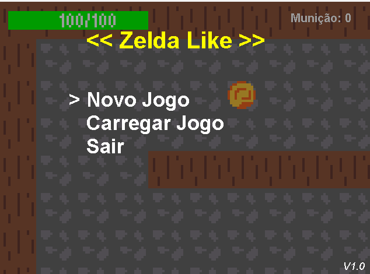
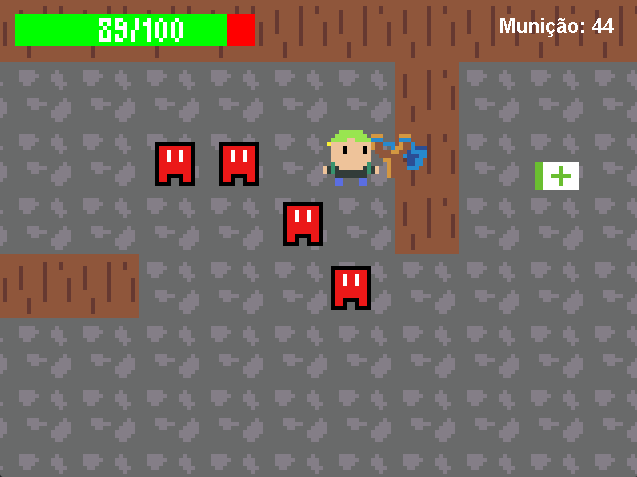
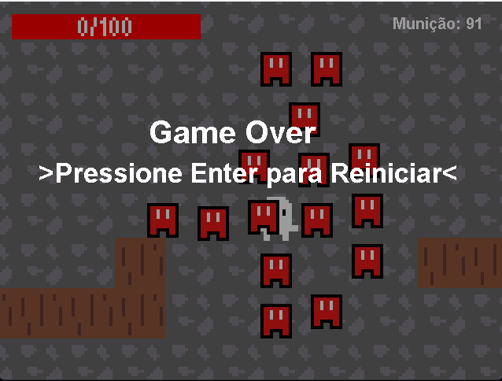

# Zelda Like Game

---

This is a complete Java project in which I developed a basic old-school Zelda-inspired game using a small, handmade game engine. The project was created as part of an exercise from Danki Code, a Brazilian online game development course.

## About the Project

This project features a robust sprite sheet management system and map generation based on small pixelated templates. It includes a keyboard and mouse shooting system, visual damage feedback for both the player and enemies, and three types of items:

- Gun  
- Ammo  
- Life Pack  

## Game Systems

The game also includes a basic menu system with selectable buttons, such as **Start Game** and **Continue Game** (the continue option is not functional in this version).  
It features a pause screen that appears when the **Escape** key is pressed, as well as a **Game Over** screen.

Additionally, the game has a simple user interface displaying a **life bar** and an **ammo counter** during gameplay.

    
    
     
    Menu ------------------------------  
    -------------------Running------------------
      -------------------------- Game Over
    

## Technical Details

All the code was written using only the course guidance and core Java resources, such as:

- `Canvas` class  
- `Runnable` interface  

The project was developed using the **Eclipse IDE**.

## Current Content

- 2 playable levels  
- 1 enemy type  

Everything was created purely for practice and to better understand how game logic and structure work, with a focus on building a strong class-based architecture and a clear hierarchy between classes.

## Art Assets

All pixel art assets were created by me using **Aseprite**, as part of the study and practice process.

## Notes

> All the source code is commented in Portuguese for better understanding.
